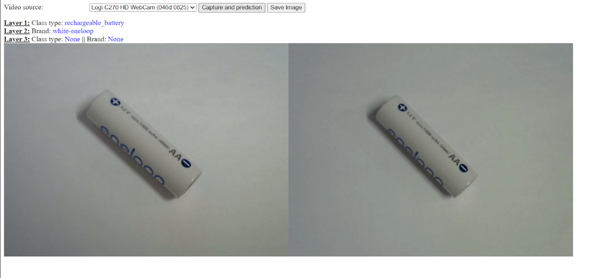

# Battery Classification Web Application

A web-based application that uses computer vision and machine learning to classify battery types and brands via webcam capture. The application leverages WebRTC for real-time camera access and PyTorch for image classification.


## Features
- Real-time webcam access and video stream display
- Capture images for battery classification
- Multi-layer classification:
  - Layer 1: Distinguishes between rechargeable and non-rechargeable batteries
  - Layer 2: Identifies specific battery brands
  - Layer 3: Refines classification for final results
- Save captured images locally
- Responsive web interface


## Demo Screenshot
The image on the left is the live view, and the image on the right is the one captured after you pressed the capture button. You can save it.




## Tech Stack
- **Frontend**: HTML5, CSS3, JavaScript, WebRTC
- **Backend**: Python, Flask
- **Machine Learning**: PyTorch, torchvision
- **Image Processing**: Pillow (PIL)


## Installation

1. Clone the repository:
   ```bash
   git clone <repository-url>
   cd battery-classification-app
   ```

2. Install required dependencies:
   ```bash
   pip install -r requirements.txt
   ```

3. Download pre-trained model files:
   https://drive.google.com/drive/folders/10yCuAxq8woJw4HRpLpq0yWfl6rUas_Ct?usp=drive_link


## Usage

1. Start the Flask server:
   ```bash
   python app.py
   ```

2. Open your web browser and navigate to:
   ```
   http://localhost:5000
   ```

3. Connect your webcam to use


## Model Classification Details

### Layer 1 Classifications
- `non_rechargeable_battery`
- `rechargeable_battery`

### Layer 2 Classifications
- Non-rechargeable: `GP-aa`, `duracell-aa`, `energizer-aaa`, `gp-super-aa`, `gp-super-aaa`, `gp-supercell-aaa`, `matsusho-aa`, `matsusho-aaa`, `matsusho-super-aa`
- Rechargeable: `Energizer`, `GP-recyko-aaa`, `black-eneloop`, `toshiba`, `white-eneloop`

### Final Classifications
- Group 1: `Energizer`, `GP-recyko-aaa`, `energizer-aaa`, `gp-super-aa`
- Group 2: `black-eneloop`, `duracell-aa`, `matsusho-super-aa`

